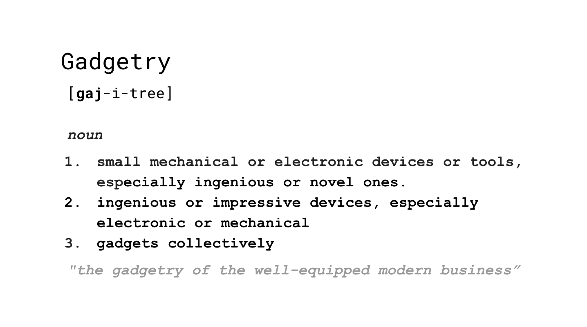
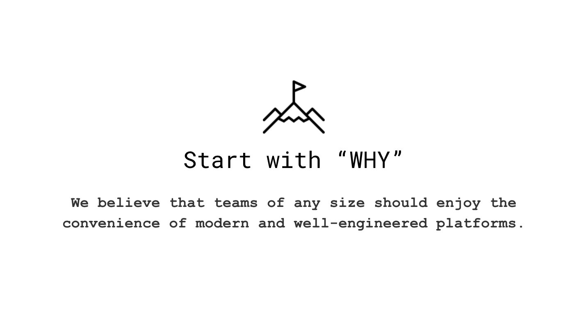
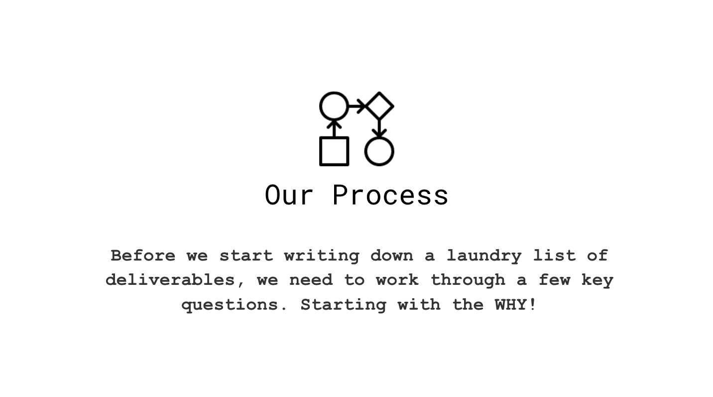
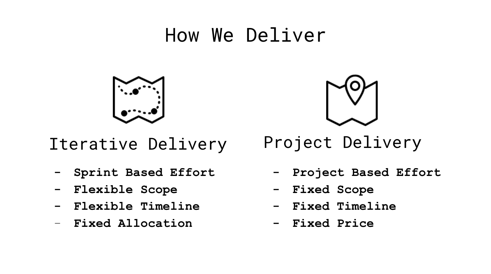
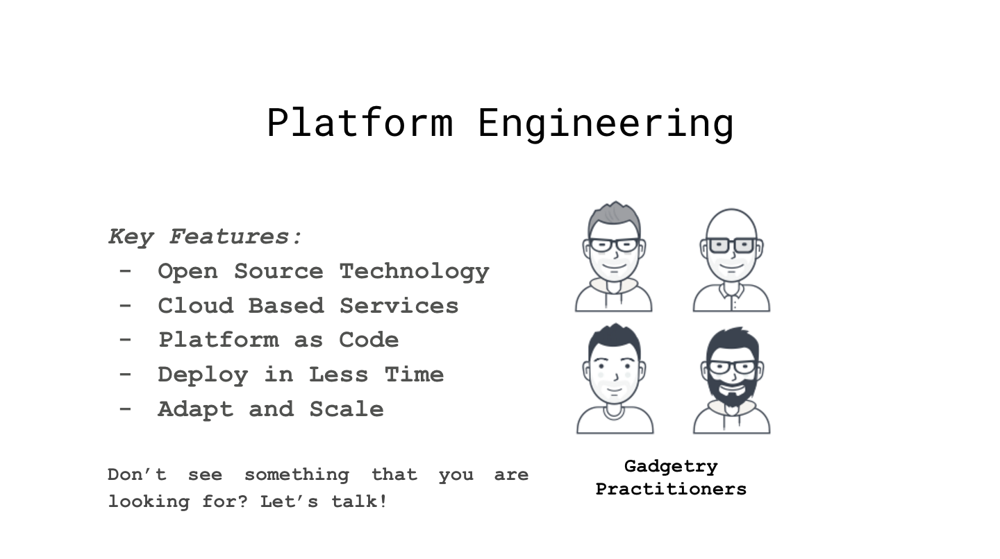
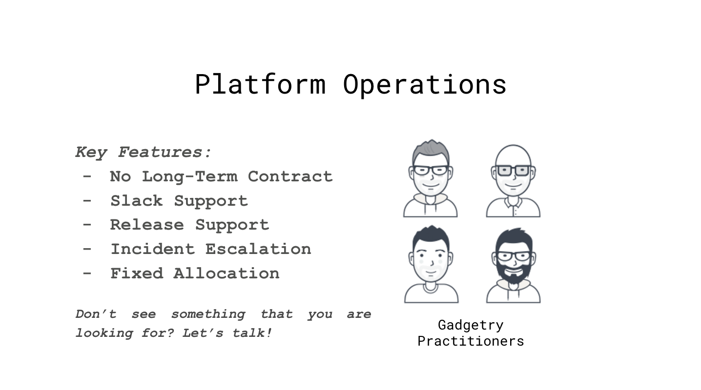

<section>
  
</section>

<section>
  
</section>

<section>
  
</section>

<section>
  
</section>

<section>
  
</section>

<section>
  
</section>

<section>
  
</section>

<section>
  
</section>

<section>
  
</section>

<section>
  
</section>

<section>
  
</section>

<section>
  
</section>

<section>
  
</section>

<section>
  
</section>

<section>
  
</section>

<section>
  
</section>

<section>
  
  
  <a href="mailto:hello@gadgetry.io?Subject=Let's Get Started!" class="btn btn-primary btn-lg" style="color:white;">&nbsp;Let's Get Started!&nbsp;</a>

</section>
